# Data Mining Proposal
#### _By : (Abhinav(1893891), Ayush(1893897), Divesh(1893900), Vrinda(1722229, Dept. Of Stats)_)
## Dataset
### Orissa Pollution Dataset
> Dimensions of dataset : (2393, 13)
Details of ambient air quality with respect to air quality parameters, like Sulfur dioxide, Nitrogen dioxide, Respirable Suspended Particulate Matter (RSPM) and Suspended Particulate Matter (SPM) etc. are given in the datasets.
## Source(main pollution dataset)
[Data.Gov](https://data.gov.in/node/6284968)
## Auxiliary Data Source(For OPD report)
[International Federation of Health Information Management Associations](http://ifhima.ml)
## Vision
* To analyze the correlation  between pollutants and area.
* Performing various statistical techniques for visualizing patterns in the air quality index.
* Predicting the type of the area depending upon the AQI.
## Techniques
* Exploratory data analysis using visualization tools.
* Clustering
* Predictive modeling
## Preliminary Analysis
As the data is about the collection of pollution levels around many areas of Orissa and attributes like __Agency__ is of no use for our analysis, it's a constant value attribute after examining the data we also found out the we could also make use the __year quarters__ and __season__ for our analysis, so we wrote the code in R to add those attributes to our dataset the we download from data.gov.   
## Preprocessing
> _Date: 4th Feb, 2019_
* Season column added according to the date in Orissa.
* Type of location ready for classification or regression.
> _Date: 5th Feb, 2019_
* Rpart code ready, [take a look Divesh](/rpart.R)
* Decision tree analysis 

* Classes in the pollution dataset : 

## Tasks 
1. To make a supervised learning model for TypeOfLocation.
2. Clustering.
3. Visualization, after calculating AQI.
4. Exploratory data analysis.
## Visualization 
> _Date: 11th Feb, 2019 Instustry wise Pollutants visualization._

> _Date: 20th Feb, 2019_
* Visualization part 
* 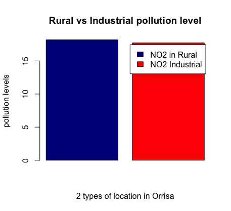
* 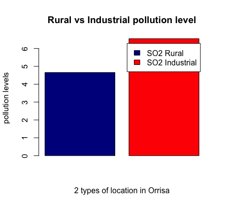
* 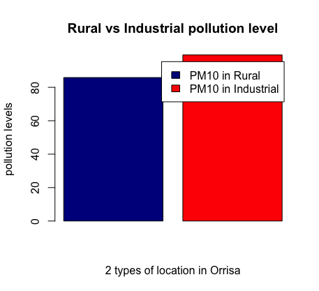
### _Here we can infer that major factor for SO2 and NO2 pollutants is industrail pollution and RSPM.PM10 pollutants concentration is almost same for industrail and rural areas in Orissa._ 
> _Date: 25th Feb, 2019_
* Search for new dataset and associate it with data we have.
> _Date: 27th Feb, 2019_
### Scatter plots
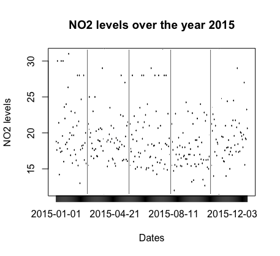
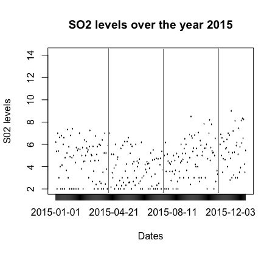
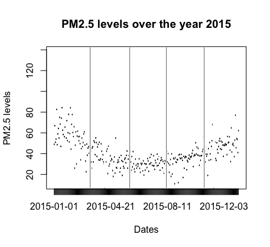
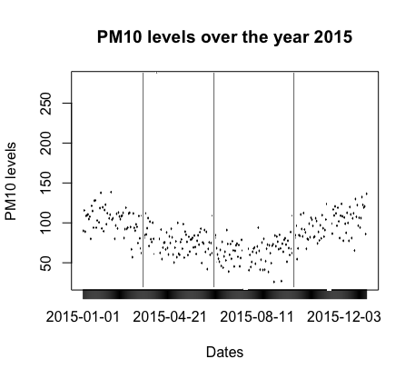
## FIRST ANALYSIS
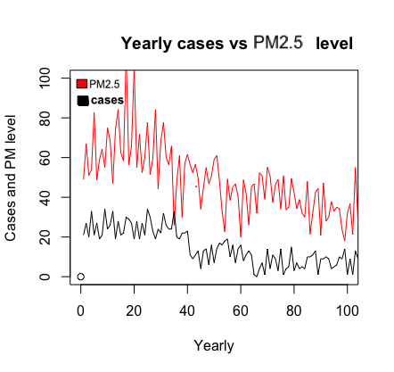
> ## From here what we can deduce is more the pollutant PM2.5 level more is the number of cases of **Emphysema**.

> _Date: 1st March, 2019_
### Yearly Analysis
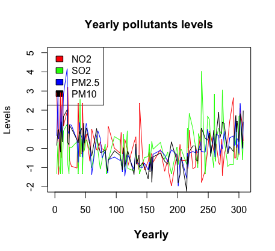
> ## Here we had to normalize the data since the ranges for the pollutant levels differs vastly.
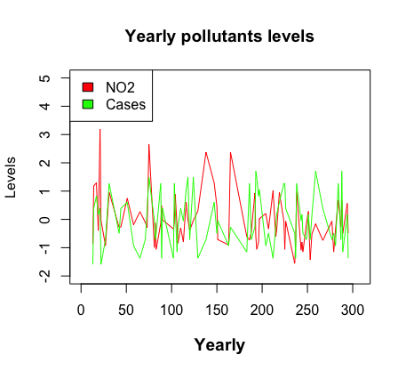
> ## From here we can't say anything that whether the levels of NO2 are causing increase or decrease in the cases of Nephrology. 

# Piechart

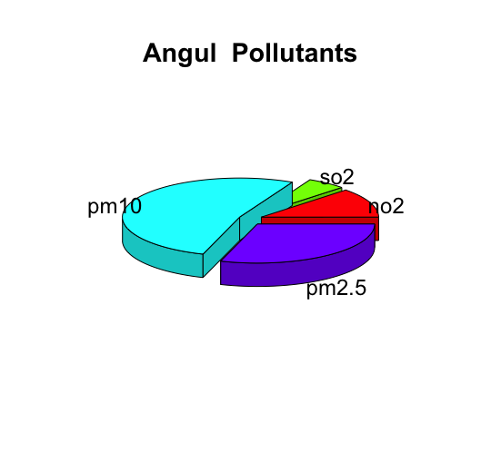
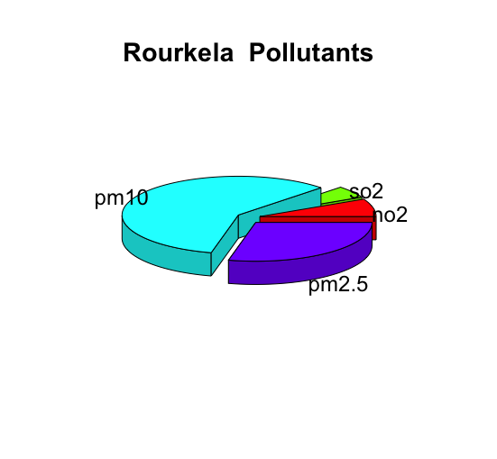
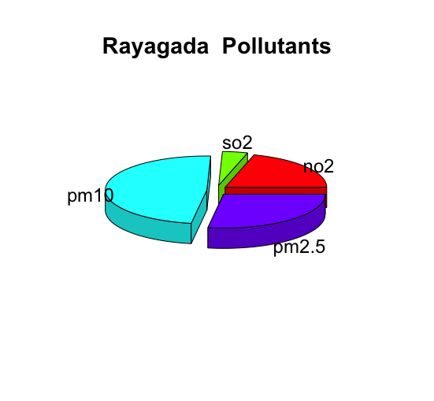
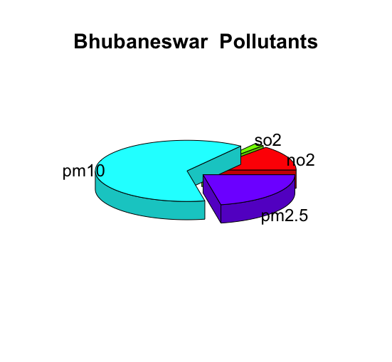
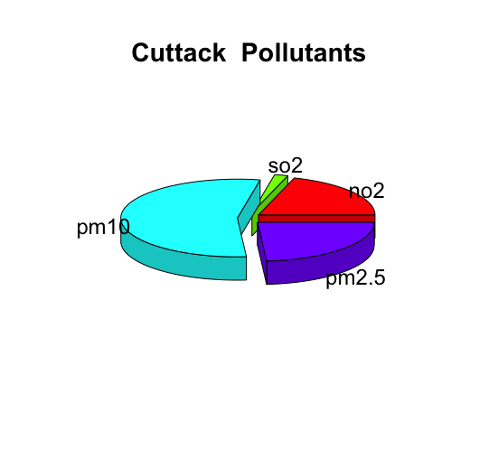
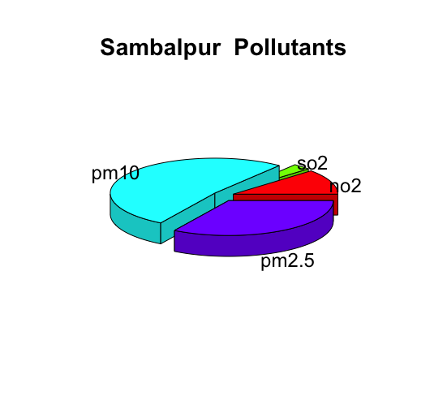
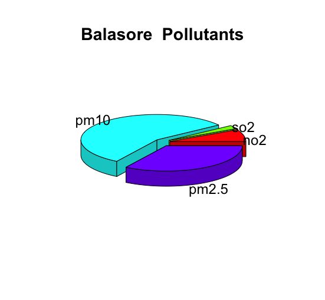
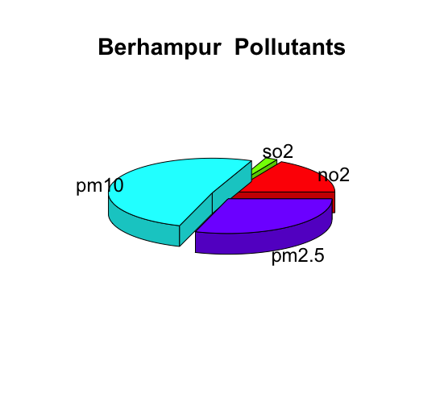
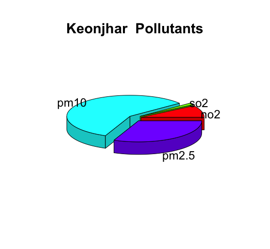

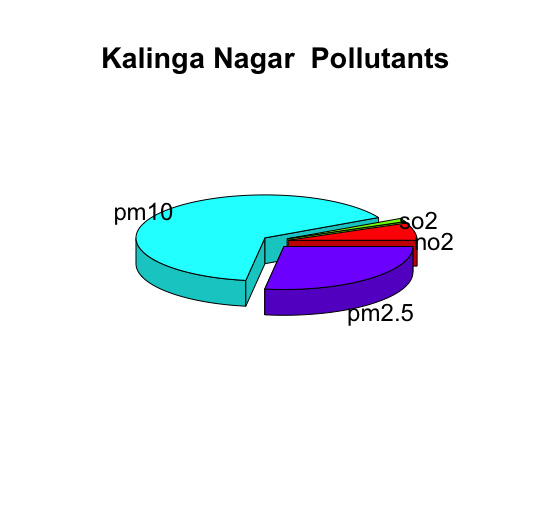
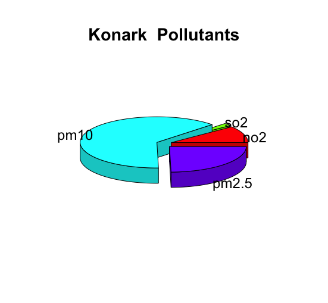
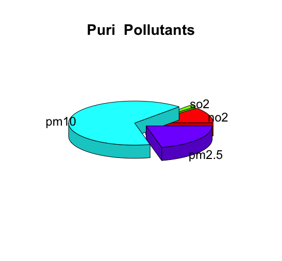
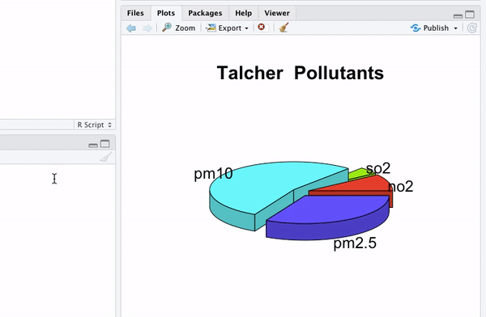

# Corrplot

# Prediction of city dependening upon the pollution level

